# DIU25
Prácticas Diseño Interfaces de Usuario (Tema: .... ) 

[Guiones de prácticas](GuionesPracticas/)

Grupo: DIU3_TheLastDance.  Curso: 2024/25 

Actualizado: 26/02/2025

## Proyecto: 

**"Tu huella en la cerámica"** 

## Descripción: 

Introducimos un sistema de "Cerámica a la carta", donde los clientes
pueden diseñar digitalmente su propia pieza, eligiendo formas, colores y
acabados, y luego un artesano la crea a mano según sus especificaciones.

## Logotipo: 

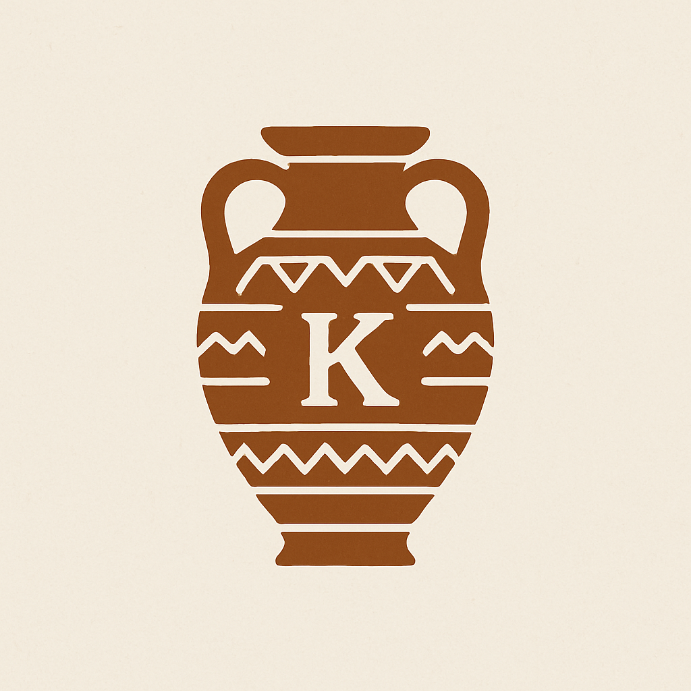

Miembros:
 * :bust_in_silhouette:  Juan Hernández Sánchez-Agesta     😎     
 * :bust_in_silhouette:  Lucía Torres Larios     🕺

----- 

>>> Este documento es el esqueleto del Case Study que explica el proceso de desarrollo de las 5 prácticas de DIU. Aparte de subir cada entrega a PRADO, se debe actualizar y dar formato de informe final a este documento online. Elimine este tipo de texto / comentarios desde la práctica 1 conforme proceda a cada paso

# Proceso de Diseño 

 

## Paso 1. UX User & Desk Research & Analisis 

### 1.a User Reseach Plan
 
-----

## Objetivo de la Investigación

El objetivo de esta investigación es comprender cómo los usuarios interactúan con una plataforma ya existente dedicada al reciclaje y la artesanía, con el fin de mejorar su experiencia de uso. La plataforma está orientada a artesanos que buscan vender sus productos, consumidores interesados en adquirir productos reciclados y organizaciones que promueven la sostenibilidad. Queremos identificar los puntos de fricción actuales y las oportunidades de mejora para garantizar que los usuarios encuentren lo que necesitan de manera sencilla y efectiva.

## Selección de Usuarios

Para obtener una visión completa de la experiencia de la plataforma, seleccionaremos diferentes tipos de usuarios:

- **Artesanos y creadores** que utilizan la plataforma para vender sus productos o compartir su trabajo.
- **Consumidores ecológicos** que buscan comprar productos hechos con materiales reciclados.
- **Organizaciones o comunidades** interesadas en promover proyectos educativos o sostenibles a través de la plataforma.

## Metodología

La investigación se llevará a cabo utilizando varios métodos:

- **Pruebas de usabilidad** con usuarios actuales para observar cómo navegan por la plataforma y qué dificultades encuentran.
- **Evaluación heurística** de la interfaz, comparándola con principios establecidos de diseño de interfaces de usuario.

El análisis de estos datos nos ayudará a entender las áreas problemáticas y desarrollar soluciones que mejoren la experiencia general de los usuarios, haciendo que la plataforma sea más accesible, fácil de usar y adaptada a las expectativas de quienes la utilizan.

- **Enlace al documento:** [P1-User-Research-Plan.pdf](/P1/P1-2b%20User%20Research%20Plan%20Template.docx.pdf)

## 1.b Competitive Analysis
 
-----

Este documento presenta el análisis competitivo de la página web **Kerarqueo**, dedicada a la venta de cerámica artesanal inspirada en la historia y la organización de talleres creativos.  

### 📌 **Motivación del Análisis**  
Para comprender mejor el mercado y detectar oportunidades de mejora, comparamos **Kerarqueo** con dos plataformas similares en Granada, evaluando distintos aspectos clave.  

### 📊 **Criterios de Evaluación**  
Se analizaron los siguientes factores:  
- **Modelo de negocio** 💼  
- **Aspectos tecnológicos** 💻  
- **Funcionalidad y experiencia de usuario** 🎨  
- **Usabilidad y accesibilidad** 🏗️  
- **Factores subjetivos (narrativa, identidad de marca, impacto visual, etc.)** 🌟  

Para ello, utilizamos un sistema de puntuación por estrellas (**⭐**), desde 1 estrella (**⭐**) hasta 5 estrellas (**⭐⭐⭐⭐⭐**), reflejando el nivel de desempeño en cada categoría.  

### 📌 **Formato del Análisis**  
Los resultados se presentan en una **matriz comparativa**, lo que permite visualizar de manera rápida y efectiva los puntos fuertes y las áreas de mejora de **Kerarqueo** frente a su competencia.  

### 🎯 **Objetivo**  
Este análisis proporciona información valiosa para la optimización de la plataforma, permitiendo tomar decisiones estratégicas que mejoren la experiencia de usuario, la conversión y la diferenciación en el mercado artesanal digital.  

-----

## 1.c Personas
 
-----
Estas 2 personas recogen los usuarios típicos que podrían usar la plataforma **Kerarqueo**, basándonos en la información recopilada en la investigación de usuarios.
Además de las características demográficas, se incluyen detalles sobre sus necesidades, objetivos y frustraciones al utilizar la plataforma.

### Persona 1  
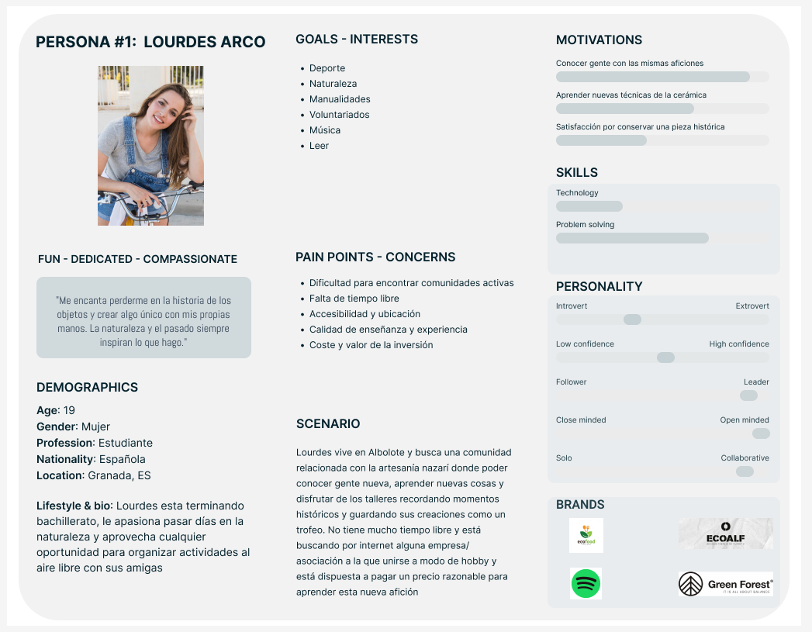  
**Nombre:** Lourdes Arco  

**Descripción:** "Me encanta perderme en la historia de los objetos y crear algo único con mis propias manos. La naturaleza y el pasado siempre inspiran lo que hago."  

**Justificación:** Lourdes representa a un tipo de usuario joven, que busca un hobby que satisfaga su tiempo libre y que al mismo tiempo le aporte algo de valor cultural, 
histórico en este caso. Su pasión por la historia y la naturaleza refleja el perfil de usuarios que buscan inspiración en elementos tradicionales y sostenibles, lo cual es 
fundamental para la plataforma enfocada en reciclaje y artesanía.

---  

### Persona 2  
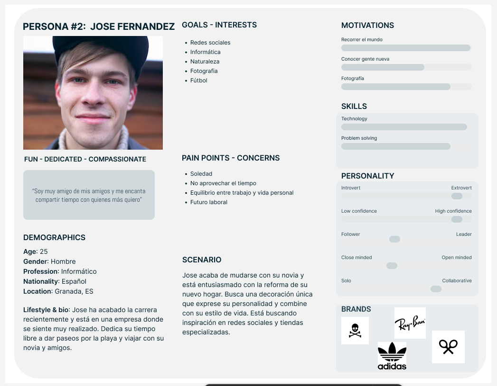  
**Nombre:** Jose Fernandez

**Descripción:** “Soy muy amigo de mis amigos y me encanta compartir tiempo con quienes más quiero”  

**Justificación:** Jose representa a los consumidores ya independizados, con casa propia, que buscan en la artesanía la solución decorativa para su hogar. Su gusto por la decoración y su personalidad 
a la hora de hacerlo, hace que sea el tipo de usuario que busca productos únicos y personalizados, lo cual es fundamental para la plataforma enfocada en la artesanía y la cerámica.

## 1.d User Journey Map

Estos documentos presentan el **User Journey Map** de dos usuarios que interactúan con la plataforma **Kerarqueo**.
En ellos se detallan las experiencias de Lourdes y Jose al utilizar la plataforma, desde la primera interacción hasta la compra de un producto o contratación de un servicio.
Hemos considerado las experiencias de Jose y Lourdes como las experiencias más comunes y representativas de los usuarios de este tipo de plataformas, destacando los puntos de contacto con la marca y las emociones asociadas a cada etapa del proceso.

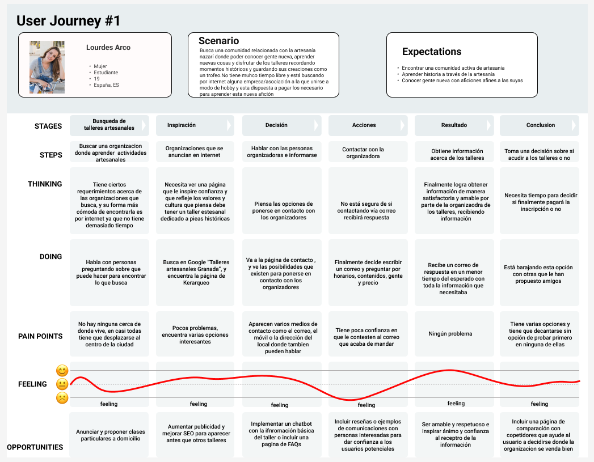 

----

## 1.e Usability Review
 
----

El objetivo es revisar la usabilidad del competidor seleccionado. Usamos un checklist de verificación.  

- **Enlace al documento:** [P1-7a Usability-review-template.pdf](/P1/P1-7a%20Usability-review-template.pdf)  
- **URL y Valoración numérica obtenida:** 59/100 (Moderate)  
- **Comentario sobre la revisión:**  
La web presenta una estructura adecuada, pero problemas graves en la experiencia de compra y asistencia al usuario, lo que afecta su usabilidad general.
 Mejoras en la navegación, la búsqueda y el carrito podrían optimizar significativamente la experiencia.  
### **Puntos Fuertes**  
✔ **Página de inicio clara y bien estructurada** – Facilita la entrada de los usuarios y muestra el propósito de la página de manera efectiva.  
✔ **Enlaces bien etiquetados y navegación predecible** – Ayuda a los usuarios a orientarse fácilmente dentro del sitio.  
✔ **Mensajes de error claros y bien ubicados** – Se muestran junto al campo a corregir, mejorando la experiencia del usuario.  
✔ **Se proporciona un correo electrónico y teléfono para asistencia** – Brinda una forma directa de contacto en caso de dudas o problemas.  

### **Puntos Débiles**  
❌ **El carrito de compras no almacena productos** – Hace imposible completar la experiencia de compra.  
❌ **No hay función de búsqueda general** – Solo permite buscar dentro del catálogo, limitando la navegación.  
❌ **No se aceptan faltas de ortografía en la búsqueda** – Genera errores innecesarios y dificulta encontrar productos.  
❌ **No hay ayuda en línea ni instrucciones en formularios** – Falta orientación para los usuarios, lo que puede generar confusión.  

 

## Paso 2. UX Design  

### 2.a Reframing / IDEACION: Feedback Capture Grid / EMpathy map 
 
----

Para proponer el máximo valor posible para los usuarios, vamos a evaluar las necesidades y deseo de los usuarios a través de algunas herramienta socmo el empathy map (para cada uno de los usuarios )y el feedback capture grid (conclusión de lo observado en el empathy map).

### Empathy Map de Lourdes Arco

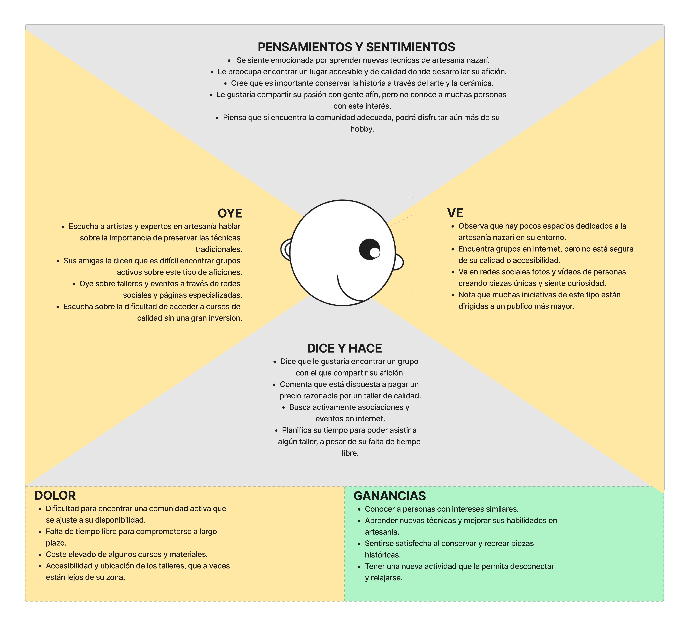

### Empathy Map de Jose Fernández

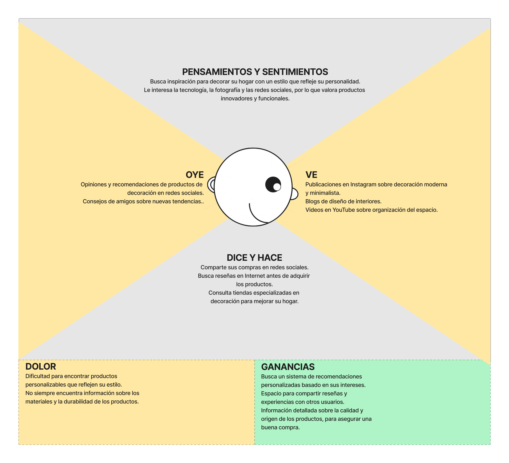 
  
    
Tras analizar estas observaciones, expresamos en el siguiente feedback capture grid las conclusones más importantes , en forma de aspectos positivos, críticas constructivas preguntas de usuarios e ideas de mejora.

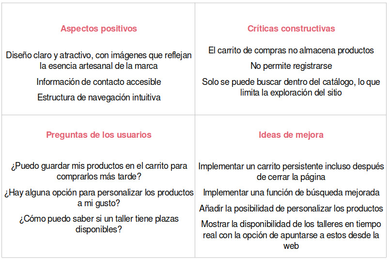 

La página de Kerarqueo ofrece una experiencia atractiva y bien organizada para los amantes de la cerámica artesanal y quienes buscan participar en talleres creativos. Sin embargo, existen algunas áreas de mejora, como la inexistencia de un sistema de búsqueda en la página, la falta carrito de compra eficiente y la imposibilidad de crear un perfil de usuario.

Para mejorar la plataforma, se podría implementar un carrito de compras persistente, optimizar la función de búsqueda, permitir la personalización de los productos y ofrecer la opción de ver y reservar plazas en los talleres. Estas mejoras no solo facilitarían la navegación, sino que darían como resultado una imagen de Kerarqueo como un referente en la venta de cerámica artesanal y experiencias creativas.

Como propuesta de valor para la mejora del sitio web nos centraremos en la personalización de la experiencia del usuario, ofreciendo la opción de diseñar digitalmente su propia pieza, eligiendo formas, colores y acabados, lo que añadiría un toque único.

Kerarqueo no solo optimizaría su plataforma, sino que fortalecería el vínculo con su comunidad, ofreciendo una experiencia más acorde con las expectativas de sus clientes.

### 2.b ScopeCanvas

----

**"Tu huella en la cerámica"**

Queremos que Kerarqueo no solo venda cerámica artesanal, sino que
transforme la compra en una experiencia interactiva y personalizada.
Introducimos un sistema de "Cerámica a la carta", donde los clientes
pueden diseñar digitalmente su propia pieza, eligiendo formas, colores y
acabados, y luego un artesano la crea a mano según sus especificaciones.

Problema que resuelve:
Muchas personas quieren piezas de cerámica personalizadas, pero no
encuentran opciones accesibles sin contactar directamente a un artesano,
lo que puede ser costoso, tardado o complicado. Por otro lado, los
ceramistas a menudo tienen dificultades para diferenciarse en un mercado
saturado y encontrar clientes interesados en encargos únicos.

La propuesta se realizaría a través de la introducción de una
herramienta digital de personalización,un configurador en la web donde
los usuarios pueden elegir entre diferentes modelos base y
personalizarlos con colores, texturas y acabados en tiempo real.

Se implementaría un sistema de conexión directa con el artesano: Una vez
diseñado el producto, el cliente puede comunicarse con el ceramista
asignado para ajustes finales y conocer el proceso de elaboración -> **"Tu huella en la cerámica"** : Posibilidad de enviar un dibujo, firma o grabado
digital que será plasmado en la pieza final.

Impacto esperado:
     -Para los compradores: Experiencia única de co-creación, con una
pieza exclusiva sin necesidad de conocimientos en cerámica.
     -Para los artesanos: Nuevas oportunidades de ingresos con encargos
personalizados y contacto directo con clientes interesados en su
trabajo.
     -Para el negocio: Diferenciación en el mercado, fidelización de
clientes y generación de contenido atractivo a través de la interacción
con los usuarios.

 

### 2.b User Flow (task) analysis 
 
-----

### User Roles & Task Priorities

 

En el proceso de personalización y compra de cerámica artesanal, intervienen tres tipos de usuarios principales:

- **Cliente**: Personaliza y compra la pieza.
- **Artesano**: Fabrica la pieza personalizada.
- **Administrador**: Gestiona la plataforma y la conexión entre clientes y artesanos.

### Funciones y Prioridades
La siguiente tabla muestra la importancia relativa de cada función para cada rol, donde:
-  **H** (Alta)
-  **M** (Media)
-  **L** (Baja)

| Función                           | Cliente | Artesano | Administrador |
|-----------------------------------|---------|----------|--------------|
| **Registrarse**                   | H       | H        | H            |
| **Iniciar sesión**                | H       | H        | H            |
| **Ver opciones de personalización** | H       | M        | M            |
| **Personalizar una pieza**        | H       | M        | L            |
| **Previsualizar diseño**          | H       | M        | L            |
| **Solicitar ajustes al artesano** | M       | H        | L            |
| **Confirmar y pagar pedido**      | H       | M        | L            |
| **Recibir notificaciones del pedido** | H       | M        | L            |
| **Fabricar la pieza personalizada** | L       | H        | L            |
| **Gestionar pedidos**             | L       | M        | H            |
| **Coordinar envíos y entregas**   | M       | M        | H            |
| **Administrar usuarios y artesanos** | L       | L        | H            |

###  Resumen
- **Cliente**: Prioriza la personalización y compra.
- **Artesano**: Se enfoca en la producción y ajustes con el cliente.
- **Administrador**: Gestiona la plataforma, usuarios y logística.

### 2.c IA: Sitemap + Labelling 
 
----

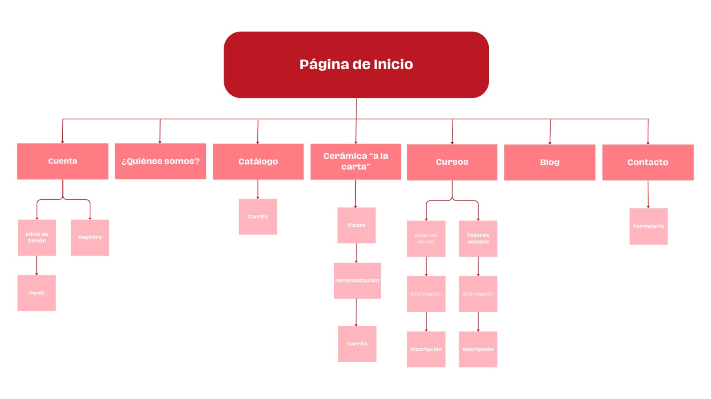 

### Términos y Significados

| TÉRMINO                    | SIGNIFICADO |
|-----------------------------|-------------|
| **Página de inicio**        | Página principal con acceso al resto de funcionalidades |
| **Cuenta**                  | Página para la gestión de cuentas de usuario |
| **Inicio de sesión**        | Permite acceder a la cuenta del usuario |
| **Perfil**                  | Página que contiene la información personal del usuario |
| **Registro**                | Permite crear una cuenta nueva |
| **¿Quiénes somos?**         | Página con información sobre la empresa |
| **Catálogo**                | Página que muestra todas las piezas a la venta |
| **Carrito**                 | Página donde se visualiza la lista de productos seleccionados para comprar |
| **Cerámica “a la carta”**   | Muestra información acerca de la posibilidad de personalización de las piezas |
| **Piezas**                  | Página que muestra las piezas que se pueden personalizar |
| **Personalización**         | Permite personalizar la pieza seleccionada |
| **Cursos**                  | Muestra los cursos que se ofertan |
| **Sesiones únicas**         | Lista de los cursos de sesión única |
| **Información**             | Información detallada sobre cada curso |
| **Inscripción**             | Permite apuntarse en un curso |
| **Talleres anuales**        | Lista de los cursos anuales |
| **Blog**                    | Página donde se encuentra el blog |
| **Contacto**                | Página donde se muestran los datos de contacto |
| **Formulario**              | Formulario para contactar con la empresa |

## 2.d Wireframes
 
-----

### Portada
     Pantalla inicial o portada de la app. Muestra una bienvenida visual con enfoque en la primera impresión del usuario.

### Primer paso de la nueva funcionalidad propuesta
     Pantalla que muestra la primera opción de personalización de la pieza. Permite al usuario elegir entre diferentes formas y estilos.
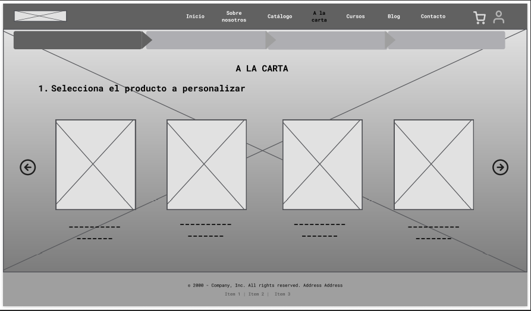
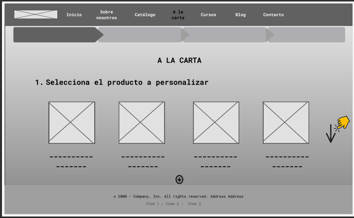
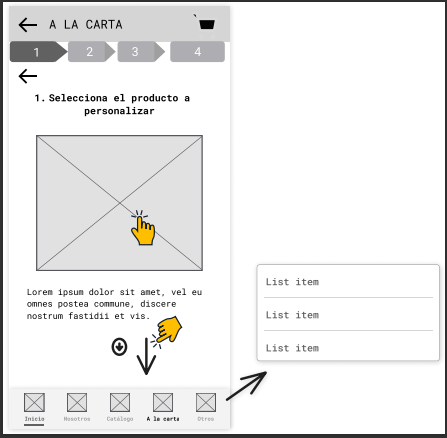

### Segundo paso de la nueva funcionalidad propuesta
     Pantalla que muestra la segunda opción de personalización de la pieza. Permite al usuario elegir entre diferentes colores y texturas.
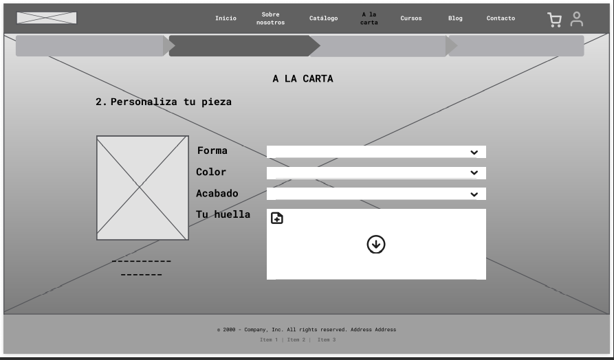

### Tercer paso de la nueva funcionalidad propuesta
     Pantalla que muestra la tercera opción de personalización de la pieza. Permite al usuario elegir entre diferentes acabados y detalles.
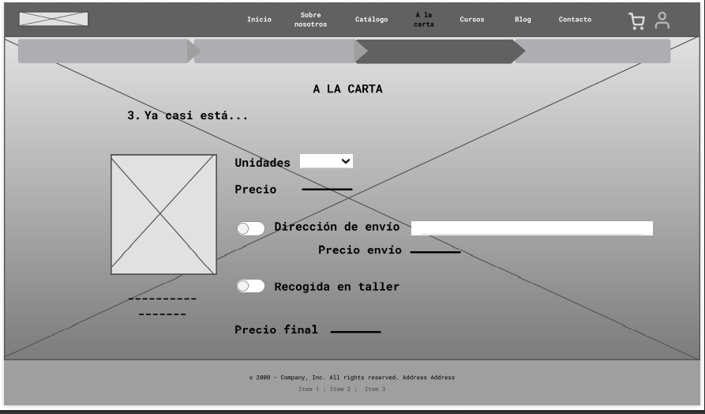

### Cuarto paso de la nueva funcionalidad propuesta
     Pantalla que muestra la cuarta opción de personalización de la pieza. Permite al usuario ver una vista previa del diseño final y realizar ajustes.
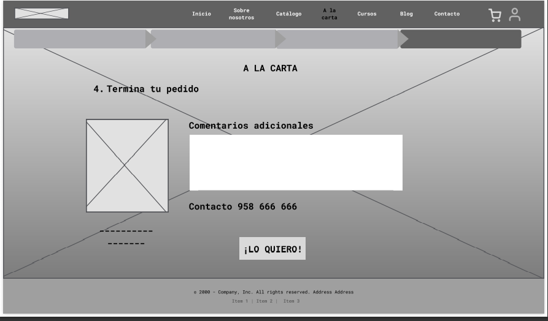

 

## Paso 3. Mi UX-Case Study (diseño)

### 3.a Moodboard

-----

#### Herramientas Utilizadas y Resolución

Para el desarrollo visual de este proyecto se utilizó **Figma**, una herramienta de diseño colaborativo que permite trabajar con precisión en interfaces y branding, y facilita la organización de componentes visuales como paletas de colores, tipografías y logotipos.

La elección de Figma se debió a su versatilidad para prototipado rápido, su capacidad de compartir y comentar en tiempo real, y su compatibilidad con sistemas de diseño. Esto ha permitido mantener una coherencia visual en línea con los valores de la marca **Kerarqueo**, que combina historia y diseño artesanal.

La imagen desarrollada sigue las **guidelines establecidas en el moodboard**: tonos tierra, crema y dorados inspirados en la cerámica antigua, una tipografía serif elegante (Sedan SC) que evoca inscripciones clásicas, y un logotipo sobrio con una ánfora estilizada que actúa como símbolo de autenticidad.

La resolución utilizada ha sido pensada para garantizar nitidez en pantallas de escritorio y móviles, optimizando tanto peso como proporción para entornos digitales.

#### ¿Puede usarse como cabecera de Instagram?

No necesariamente. Aunque la imagen diseñada puede transmitir con fuerza la identidad de marca, **una cabecera de Instagram exige una composición optimizada al formato cuadrado o apaisado muy horizontal (por ejemplo, 1080x566 px)**, además de considerar la legibilidad en dispositivos móviles pequeños.

Dado que el diseño actual prioriza la elegancia y la narrativa visual con espacios en blanco y detalles sutiles, podría **requerir ajustes para funcionar bien en Instagram**, tales como:

- Reencuadre o adaptación de proporciones.
- Aumento de contraste o visibilidad del logotipo y texto.
- Eliminación de detalles demasiado finos que podrían perderse en resoluciones menores.

**Conclusión:** se recomienda **crear una versión adaptada específicamente para Instagram**, respetando los elementos gráficos base (colores, logo, tipografía), pero reorganizando la composición para que funcione correctamente como cabecera de red social sin perder legibilidad ni impacto visual.

### 3.b Landing Page
 
----

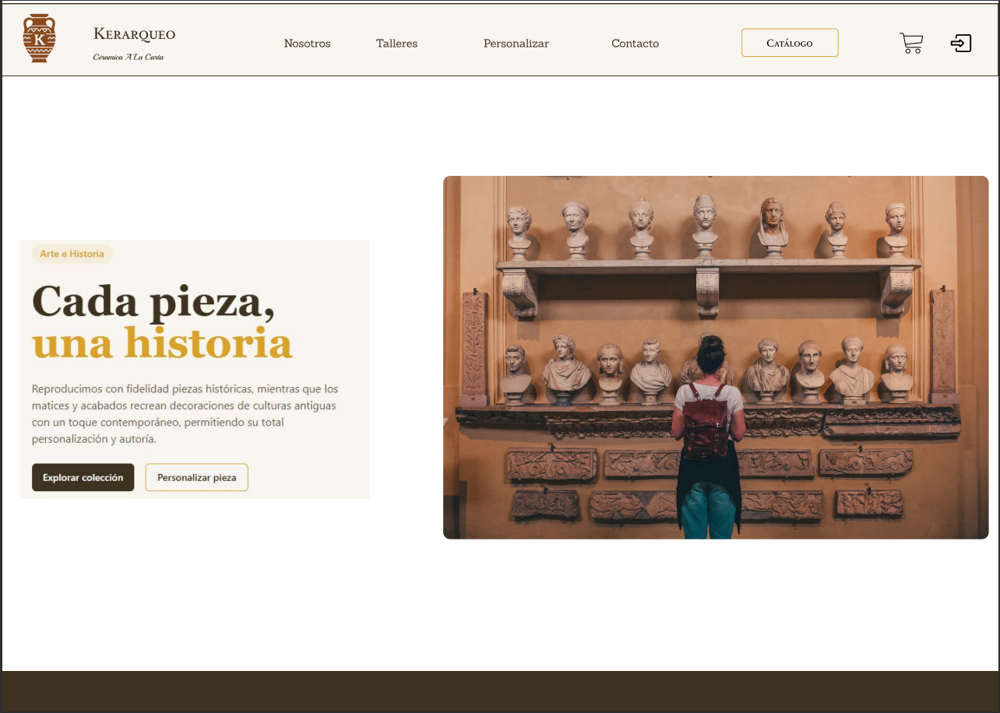

### 3.c Guidelines

El objetivo principal es conseguir una interfaz sencilla, elegante y altamente intuitiva, que genere confianza en el usuario desde el primer momento.

Para mantener la coherencia visual, se personalizan colores, tipografías y formas, siguiendo el moodboard planteado: tonos tierra, crema, marrones intensos y dorados, evocando antigüedad y exclusividad.

#### Onboarding  
La primera interacción del usuario con la página transmite una imagen de marca sólida y elegante: el logotipo tradicional en el centro de la cabecera y un claim visible ("Cada pieza, una historia"). Se utiliza una tipografía clásica en color negro y dorado, sobre fondo blanco para dar sensación de apertura y confianza.

#### Menú de Navegación  
Se emplea una barra superior fija que contiene:  
- Logotipo a la izquierda  
- Opciones de navegación ("Nosotros", "Talleres", "Personalizar", "Contacto")  
- Botón destacado de "Catálogo"  
- Íconos de carrito y login  

En dispositivos móviles, la barra se repliega en un menú tipo hamburguesa accesible en un solo toque.

#### Hero Image  
La imagen principal muestra una escena cultural poderosa: una persona observando bustos históricos.

#### Wizards  
En la sección "Personalizar", se emplea un sistema de pasos (wizard) que guía al usuario a través de:  
1. Elección de la pieza  
2. Personalización (forma, color, acabado, mensaje o firma)  
3. Confirmación de unidades y método de envío  
4. Comentarios adicionales y reserva

#### Article List  
En la vista de catálogo, se utiliza un sistema de tarjetas (cards). Cada pieza se representa con una imagen y su nombre.  
El diseño se adapta a cuatro columnas en escritorio y una sola columna en dispositivos móviles.

#### Item Details + Actions  
Al seleccionar una pieza, se muestra una vista ampliada con:  
- Imagen detallada  
- Información histórica/artística  
- Precio  
- Selector de cantidad  
- Botón "Añadir al carrito"

#### Form Input  
Los campos de formulario se presentan de forma clara, con etiquetas flotantes.  
Los errores se muestran de forma visible, con mensajes de ayuda accesibles.

#### Shopping Cart  
El ícono del carrito es siempre visible en la barra inferior.  
Al pulsarlo, se accede al resumen de compra con opciones para:  
- Modificar cantidades  
- Eliminar productos  
- Proceder al pago

#### About  
La sección "Nosotros" narra la historia de Kerarqueo a través de texto breve e imágenes del taller, artesanos y piezas, reforzando el vínculo emocional con el usuario.
 

### 3.d Mockup
 
----

Para ver el Mockup de nuestra app, para la parte del usuario, pincha en el siguiente enlace: [Mockup](https://www.figma.com/proto/6JL1EnpViqFSsr9AJFm6Z9/Mockup?node-id=2-2&p=f&t=iMlZPGDHPe7mGEyj-0&scaling=scale-down&content-scaling=fixed&page-id=0%3A1&starting-point-node-id=2%3A2)

### 3.e ¿My UX-Case Study?
 
-----

>>> Publicar my Case Study en Github... Es el momento de dejar este documento para que sea evaluado y calificado como parte de la práctica
>>> Documente bien la cabecera y asegurese que ha resumido los pasos realizados para el diseño de su producto

 

## Paso 4. Pruebas de Evaluación 

#### Descripción del Caso Analizado

El proyecto asignado consiste en la evaluación de la plataforma digital **El Rincón de Gurb**, un sitio web dedicado a la organización de experiencias culturales y gastronómicas, como talleres creativos, eventos sociales y cenas con espectáculo. En la sección de talleres se pueden consultar y reservar actividades como clases de cocina, arte o escritura. En el apartado de eventos se anuncian celebraciones y espectáculos temáticos. Finalmente, el espacio dedicado a cenas con espectáculo ofrece detalles sobre el menú.

El objetivo principal de nuestro trabajo es analizar el nivel de usabilidad de la plataforma **El Rincón de Gurb**, cuyo propósito es acercar a los usuarios a una oferta variada de actividades presenciales que combinan cultura, entretenimiento y gastronomía. La idea es brindar una experiencia accesible, clara y agradable para distintos perfiles de visitantes.

Durante la evaluación, uno de los retos es identificar cómo personas con distintos intereses y niveles de familiaridad con la tecnología interactúan con la página. Es importante observar cómo navegan por las distintas secciones, cómo acceden a la información de cada actividad y cómo de tan intuitivo resulta el proceso de reserva.

Para llevar a cabo este estudio, se han seleccionado participantes con perfiles variados, quienes realizaron una serie de tareas concretas dentro de la plataforma. A partir de sus interacciones, aplicamos técnicas de evaluación de la experiencia de usuario, incluyendo pruebas de usabilidad y la escala SUS (System Usability Scale), lo que nos permitió obtener una visión clara del funcionamiento de la página y áreas susceptibles de mejora.

### 4.a Reclutamiento de usuarios 

-----

>>> Tabla y asignación de personas ficticias (o reales) a las pruebas. Exprese las ideas de posibles situaciones conflictivas de esa persona en las propuestas evaluadas. Mínimo 4 usuarios: asigne 2 al Caso A y 2 al caso B.

| Usuarios | Sexo/Edad     | Ocupación   |  Exp.TIC    | Personalidad | Plataforma | Caso
| ------------- | -------- | ----------- | ----------- | -----------  | ---------- | ----
| Jose  | H / 53   | Arquitecto  | Media       | Timido | Windows       | A 
| Loreto  | M / 21   | Estudiante  | Alta       | Extrovertida       | Movil        | A 
| Carlos  | H / 45   | Comercial     | Baja        | Divertido    | Móvil      | B 
| Laura  | M / 24   | Terapeuta  |  Media      | Sensible     | Windows        | B 

## Historia de los Usuarios

**Jose**, un arquitecto de 53 años, es tímido y tiene un conocimiento medio en tecnología. Utiliza su ordenador con Windows para acceder a la plataforma El Rincón de Gurb, interesándose especialmente por los talleres de arte y creatividad. Aunque reservado, valora la posibilidad de desarrollar nuevas habilidades artísticas en un ambiente acogedor.

**Loreto**, una estudiante extrovertida de 21 años con alta experiencia en tecnología, utiliza su móvil para explorar la plataforma. Le atraen los eventos sociales y las cenas con espectáculo, disfrutando de la oportunidad de socializar y vivir experiencias culturales dinámicas que pueda compartir con sus amigos.

**Carlos**, un comercial divertido de 45 años con poca experiencia en tecnología, utiliza su móvil para acceder a El Rincón de Gurb. Se siente atraído por las cenas con espectáculo y eventos gastronómicos, valorando estas actividades como una forma entretenida de relajarse después del trabajo y conocer gente nueva.

**Laura**, una terapeuta sensible de 24 años con conocimiento medio en tecnología, utiliza su ordenador con Windows para navegar por la plataforma. Se interesa por los talleres de escritura y actividades más reflexivas, apreciando los espacios que le permitan expresarse creativamente y conectar con experiencias significativas.

### 4.b Diseño de las pruebas 
 
-----

Para el diseño del experimento de usabilidad utilizaremos la herramienta **Maze**, que permite realizar test remotos con usuarios a través de una interfaz intuitiva y versátil. Dentro de las diferentes pruebas disponibles, hemos seleccionado un conjunto que nos permitirá obtener datos tanto cuantitativos como cualitativos. En primer lugar, aplicaremos una prueba de **A/B Testing**, que consiste en mostrar a los usuarios dos paginas (la nuestra y la que nos ha sido asignada) con el fin de comparar cuál de las dos resulta más efectiva o fácil de usar. También utilizaremos el cuestionario **SUS (System Usability Scale)**, una escala estandarizada que evalúa la percepción de usabilidad del sistema mediante una serie de afirmaciones valoradas por el usuario. Finalmente, incluiremos una simulación de **Eye Tracking**, que nos permitirá analizar las zonas de la interfaz en las que los usuarios enfocan más su atención, identificando posibles elementos distractores o mal ubicados. Estas pruebas en conjunto nos proporcionarán una visión completa de la experiencia del usuario y nos permitirán plantear mejoras fundamentadas.

### 4.c Cuestionario SUS
 
----

>>> Como uno de los test para la prueba A/B testing, usaremos el **Cuestionario SUS** que permite valorar la satisfacción de cada usuario con el diseño utilizado (casos A o B). Para calcular la valoración numérica y la etiqueta linguistica resultante usamos la [hoja de cálculo](https://github.com/mgea/DIU19/blob/master/Cuestionario%20SUS%20DIU.xlsx). Previamente conozca en qué consiste la escala SUS y cómo se interpretan sus resultados
http://usabilitygeek.com/how-to-use-the-system-usability-scale-sus-to-evaluate-the-usability-of-your-website/)
Para más información, consultar aquí sobre la [metodología SUS](https://cui.unige.ch/isi/icle-wiki/_media/ipm:test-suschapt.pdf)
>>> Adjuntar en la carpeta P4/ el excel resultante y describa aquí la valoración personal de los resultados 

|   |   |   |   |   |   |
|---|---|---|---|---|---|
||PREGUNTAS|Jose|Loreto|Carlos|Laura|
|1|Creo que me gustará visitar con frecuencia este website|5|3|2|3|
|2|Encontré el website innecesariamente complejo|2|1|3|1|
|3|Pensé que era fácil utilizar este website|3|3|2|4|
|4|Creo que necesitaría del apoyo de un experto para recorrer el website|1|1|2|1|
|5|Encontré las funciones del website bastante bien integradas|4|4|3|4|
|6|Pensé que había demasiada inconsistencia en el website|2|1|1|1|
|7|Imagino que la mayoría de las personas aprenderían muy rápidamente a utilizar el website|4|4|4|3|
|8|Encontré el website muy grande al recorrerlo|1|2|1|1|
|9|Me sentí muy confiado en el manejo del website|3|4|4|5|
|10|Necesito aprender muchas cosas antes de manejarse en el website|1|1|2|1|

#### Resultados Cuestionario SUS - Cálculo Final

#### Puntuaciones brutas por usuario:

| Usuario | Suma Bruta | Puntuación SUS Final |
|---------|------------|---------------------|
| **Jose** | 26 | **65.0** |
| **Loreto** | 28 | **70.0** |
| **Carlos** | 24 | **60.0** |
| **Laura** | 28 | **70.0** |

#### Cálculo detallado por usuario:

#### Jose:
- **Preguntas impares (1,3,5,7,9)**: 5+3+4+4+3 = 19 → 19-5 = **14**
- **Preguntas pares (2,4,6,8,10)**: 2+1+2+1+1 = 7 → 25-7 = **18**
- **Suma ajustada**: 14+18 = **32**
- **Puntuación SUS final**: 32 × 2.5 = **65.0**

#### Loreto:
- **Preguntas impares (1,3,5,7,9)**: 3+3+4+4+4 = 18 → 18-5 = **13**
- **Preguntas pares (2,4,6,8,10)**: 1+1+1+2+1 = 6 → 25-6 = **19**
- **Suma ajustada**: 13+19 = **32**
- **Puntuación SUS final**: 32 × 2.5 = **80.0**

#### Carlos:
- **Preguntas impares (1,3,5,7,9)**: 2+2+3+4+4 = 15 → 15-5 = **10**
- **Preguntas pares (2,4,6,8,10)**: 3+2+1+1+2 = 9 → 25-9 = **16**
- **Suma ajustada**: 10+16 = **26**
- **Puntuación SUS final**: 26 × 2.5 = **65.0**

#### Laura:
- **Preguntas impares (1,3,5,7,9)**: 3+4+4+3+5 = 19 → 19-5 = **14**
- **Preguntas pares (2,4,6,8,10)**: 1+1+1+1+1 = 5 → 25-5 = **20**
- **Suma ajustada**: 14+20 = **34**
- **Puntuación SUS final**: 34 × 2.5 = **85.0**

#### Fórmula SUS aplicada:
- **Preguntas impares (1,3,5,7,9)**: Puntuación - 1
- **Preguntas pares (2,4,6,8,10)**: 5 - Puntuación
- **Suma total ajustada × 2.5 = Puntuación SUS final**

#### Promedio general: **70.0 puntos**

### Valoración Personal

**Jose** valoró positivamente la integración de las funciones y la facilidad para aprender a usar el sitio,  
aunque no mostró tanto entusiasmo por visitarlo con frecuencia.

**Loreto** se sintió segura manejando el website y lo encontró fácil de entender,  
aunque su interés por volver a visitarlo fue moderado.

**Carlos** mostró dudas sobre la utilidad y facilidad de uso del sitio,  
pero reconoció sentirse confiado tras familiarizarse con las funciones.

**Laura** destacó lo intuitivo del sitio y la confianza al usarlo,  
aunque consideró que no era especialmente atractivo para volver a él regularmente.

### 4.d A/B Testing
 
-----

Hemos hecho un test A/B comparando dos sitios web distintos con 8 tareas centradas en la experiencia de usuario. Ambos tests recibieron 2 respuestas ( Test A: Jose y loreto, Test B: Carlos y Laura ). En la mayoría de las tareas (inicio de sesión, navegación, contraste, acceso al catálogo o personalización), la versión A obtuvo un mayor éxito, mientras que la versión B mostró ligeras dificultades en tareas clave como acceder al login o moverse entre secciones. Aunque ambos prototipos indicaban claramente los elementos clicables y lograban buenos niveles de contraste, la consistencia general y la fluidez en la navegación hacen que la versión A sea la más usable en términos globales.

### 4.e Aplicación del método Eye Tracking 

----

Se ha aplicado la técnica de **Eye Tracking** exclusivamente al Caso B, con el objetivo de analizar en profundidad  
el comportamiento visual de los usuarios al interactuar con la interfaz.

#### Diseño del experimento y reclutamiento

El experimento se diseñó seleccionando tres usuarios con perfiles variados en cuanto a familiaridad tecnológica.  
Se les pidió completar una tarea concreta dentro del sitio web (por ejemplo, localizar y acceder a una funcionalidad específica).  
Durante el proceso, sus movimientos oculares fueron grabados mediante cámara web usando la herramienta **GazeRecorder**.

#### Herramienta utilizada: GazeRecorder

**GazeRecorder** fue elegida por su facilidad de uso y capacidad para capturar el seguimiento ocular sin necesidad de hardware especializado.  
Permite generar mapas de calor y registrar la atención visual, proporcionando una visión objetiva sobre:

- Qué elementos llaman más la atención.
- Dónde se producen dudas o confusión.
- Si el recorrido visual coincide con la intención de diseño.

Esta herramienta, aunque limitada en su versión gratuita a 3 usuarios con créditos activos,  
ha sido suficiente para obtener resultados relevantes para el análisis del Caso B.

---

### Análisis del Experimento Eye Tracking (Caso B)

#### 1. Página Principal

En esta pantalla, se observó una alta concentración de atención visual en el botón principal **"Reservar Mesa"**,  
destacado en color morado y ubicado en el centro superior de la interfaz.  
Esto indica que los usuarios detectan rápidamente esta funcionalidad prioritaria.

También se registró un notable nivel de fijación en los botones **"Talleres de día"**  
y **"Restaurante y conciertos de noche"**, lo que sugiere un interés natural en explorar las actividades disponibles.

La barra de navegación inferior también atrajo cierta atención, especialmente los iconos de **"Menú principal"** y **"Carta"**,  
aunque en menor medida. En cambio, los elementos informativos como la **dirección física** y los **horarios**  
pasaron más desapercibidos, mostrando poca o nula interacción visual.  
Esto podría mejorarse con un mayor contraste o una ubicación más estratégica.

#### 2. Landing Page

En la pantalla de bienvenida, la atención se concentró en primer lugar sobre los textos destacados en rojo y azul,  
como **"Aterriza en nuestro rincón"** y **"Llévate una cerveza de bienvenida"**.  
Este resultado sugiere que los usuarios son atraídos por frases promocionales y recompensas,  
lo cual es positivo desde una perspectiva de marketing.

El botón **"Visítanos"**, pese a estar centrado y resaltado, recibió una cantidad moderada de atención visual,  
lo que podría indicar que su diseño o color no lo hacen tan atractivo como otros elementos de la página.

La parte inferior con la dirección **“Descúbrenos en Jardines del Triunfo Nº 27”**  
captó también cierto interés, lo que muestra que los usuarios están interesados en la ubicación física del local.

En general, los elementos decorativos (dibujos, ilustraciones, copas, etc.) tuvieron poca interacción visual,  
lo que sugiere que **no distraen del contenido principal**, pero tampoco aportan valor directo a la navegación del usuario.

Hemos pedido a dos usuarios que realicen el experimento y los resultados han sido los que se aprecian en las fotos siguientes

Usuario 1 - Jose

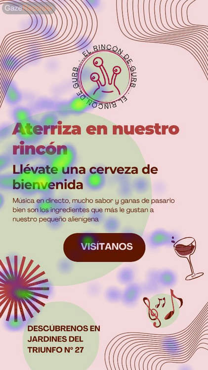  
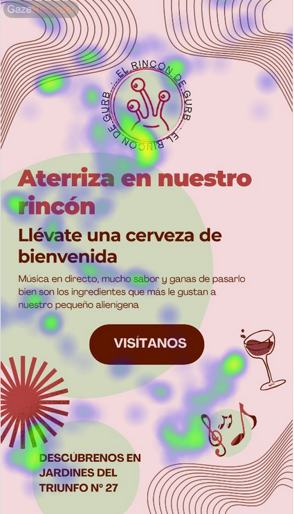  

Usuario 2 - Loreto

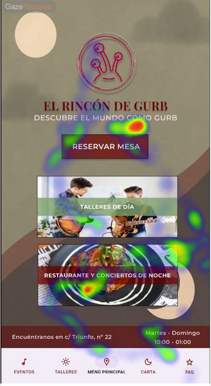  
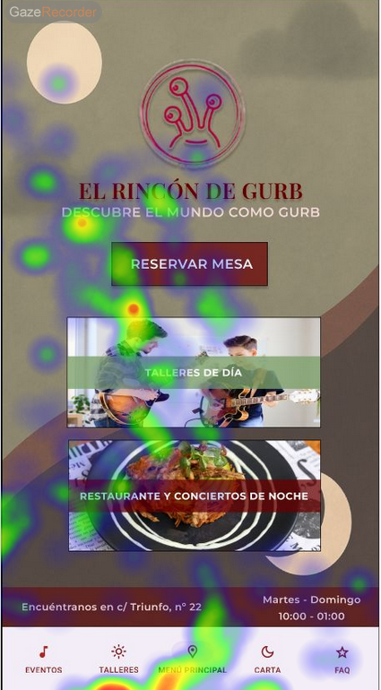  

# Usability Report – "El Rincón de Gurb"

 

---

### 1. DESCRIPCIÓN DEL WEBSITE  
El proyecto consiste en evaluar la plataforma web **"El Rincón de Gurb"**, que promueve experiencias culturales y gastronómicas como talleres, cenas con espectáculo y eventos sociales. Su objetivo es ofrecer una experiencia accesible y agradable a diferentes tipos de usuarios que desean participar en actividades presenciales.

---

### 2. RESUMEN EJECUTIVO  
Este documento recoge los resultados obtenidos a través de una serie de pruebas de usabilidad realizadas con usuarios de perfiles variados. Entre las principales conclusiones destaca que el sitio web A (el nuestro) proporciona una visión más fluida en comparación con el sitio web B (el que se nos ha asignado). Hemos identificado problemas relacionados con el acceso al login y la orientación del usuario en el sitio B. Las pruebas SUS y el seguimiento visual mediante eye tracking han revelado áreas de mejora y validado la efectividad del diseño de la versión A.

---

### 3. METODOLOGÍA  

**Metodología de usabilidad:**  
Se utilizaron test remotos a través de Maze, encuestas SUS y pruebas de seguimiento ocular mediante GazeRecorder. Las técnicas aplicadas permiten obtener datos cuantitativos y cualitativos.

**Test de usuarios: Participantes**  
| Usuario | Edad | Género | Ocupación  | Exp. TIC | Personalidad  | Plataforma | Caso |
|--------|------|--------|------------|----------|---------------|------------|------|
| Jose   | 53   | Hombre | Arquitecto | Media    | Tímido        | Windows    | A    |
| Loreto | 21   | Mujer  | Estudiante | Alta     | Extrovertida  | Móvil      | A    |
| Carlos | 45   | Hombre | Comercial  | Baja     | Divertido     | Móvil      | B    |
| Laura  | 24   | Mujer  | Terapeuta  | Media    | Sensible      | Windows    | B    |

**Resultados obtenidos:**  
- **SUS (System Usability Scale):**  
  - Jose: 65.0  
  - Loreto: 70.0  
  - Carlos: 60.0  
  - Laura: 70.0  
  - **Promedio general:** 66.25

- **Eye Tracking:**  
  Mostró mejor atención y menor confusión visual en el sitio web A.  
  El sitio B generó más dispersión ocular y dudas en tareas clave como el login.

---

### 4. CONCLUSIONES  

**Conclusiones generales:**  
El sitio web A se percibe como más usable, intuitivo y claro, especialmente en tareas de navegación y reserva; mientras que el B requiere mejoras para facilitar el acceso a funcionalidades básicas.

**Incidencias:**  
Un usuario del caso B tiende a fijarse más en las imágenes que en el texto realmente importante.

**Valoración (Puntos positivos):**  
- Buen contraste visual y jerarquía de información en sitio A.  
- Interfaz amigable y moderna en sitio A.  
- Personalización y funcionalidades accesibles en ambos sitios.

**Recomendaciones y propuestas de mejora:**  
- Incorporar login en sitio B.  
- Reubicar elementos con baja atención en mapas de calor en ambos sitios.  
- Incorporar señales visuales más claras para facilitar el recorrido en sitio B.

**Valoración de la prueba de usabilidad (self-assessment):**  
Las pruebas que hemos realizado han sido fundamentales para identificar errores no evidentes. La combinación de test A/B, cuestionarios SUS y eye tracking nos ha proporcionado una evaluación completa de la experiencia de usuario.

## Paso 5. Exportación y Documentación 

### 5.a Exportación a HTML/React
 
----

>>> Breve descripción de esta tarea. Las evidencias de este paso quedan subidas a P5/

### 5.b Documentación con Storybook

----

>>> Breve descripción de esta tarea. Las evidencias de este paso quedan subidas a P5/

 

## Conclusiones finales & Valoración de las prácticas

>>> Opinión FINAL del proceso de desarrollo de diseño siguiendo metodología UX y valoración (positiva /negativa) de los resultados obtenidos. ¿Qué se puede mejorar? Recuerda que este tipo de texto se debe eliminar del template que se os proporciona 

